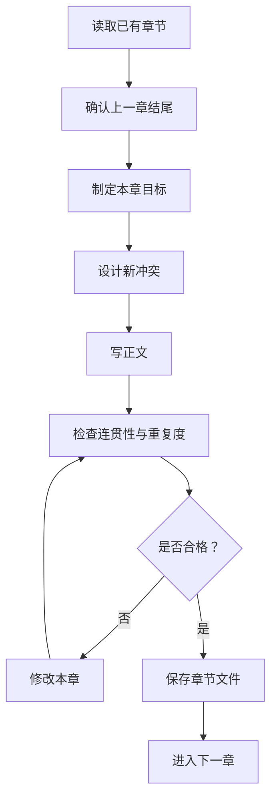

# 🚀 国内 Token 中转站

## 高速稳定 · 简单易用 · 面向 AI 创作者与开发者

 

 
 

### 🔗 官网地址：<a href="https://lzhimie.top">https://lzhimie.top</a>

---

# 连续小说 / Write Continuous Novels

### 让 AI 像真正的长篇作者一样逐章续写，而不是批量生产模板文。

---

## 简介

`write-continuous-novels` 是一款专为 AI 长篇小说写作设计的 Codex Skill。

它的核心目标，是解决 AI 写小说时最常见、也最让人头疼的问题：

- 批量生成，章节像流水线印出来；
- 剧情重复，只是换了人物、地点和奖励；
- 前后断档，下一章接不上上一章；
- 爽点循环，每章都是同一套打脸流程；
- 写得很多，但故事没有真正往前走。

这款 Skill 会强制 AI 按照“分章大纲 → 单章续写 → 章节自检 → 修改通过 → 再写下一章”的流程工作，让小说保持连续、稳定、有推进感。

---

## 核心能力

### 1. 逐章续写，不批量灌水

AI 不会一口气机械生成大量章节，而是先确认上一章结尾，再写下一章。

每一章都必须承接前文，形成清楚的因果关系。

### 2. 自动检查重复桥段

每章写完后，都会检查是否存在：

- 重复句子；
- 重复段落；
- 重复打脸套路；
- 重复反派功能；
- 重复能力用法；
- 重复章节结构。

如果发现问题，必须先修改，再继续往下写。

### 3. 保证剧情真实推进

每章都必须产生新的结果，例如：

- 主角实力变化；
- 人物关系变化；
- 新线索出现；
- 反派行动升级；
- 阶段目标完成；
- 新危机自然引出。

不是“写了两千字”，而是“故事真的往前走了”。

### 4. 适配多种小说类型

适用于：

- 都市爽文；
- 玄幻修仙；
- 系统文；
- 纯爱言情；
- 悬疑推理；
- 科幻末世；
- 商战权谋；
- 其他长篇连续小说。

无论什么题材，核心原则都是：不模板、不重复、不原地踏步。

---

## 工作流程

---

适合谁使用？

如果你遇到过这些问题，这款 Skill 就很适合你：

AI 写到后面开始“批发章节”；

明明章节很多，但剧情一直在绕圈；

每章都是同一种打脸套路；

前后剧情接不上；

主角能力、反派行为、感情线都在重复；

想让 AI 长期帮你写一部长篇完整小说。

一句话总结

write-continuous-novels 不是让 AI 写得更多，而是让 AI 写得更连贯、更像小说、更像一个真正作者在认真续写。

作者信息

---

# 🚀 国内 Token 中转站

## 高速稳定 · 简单易用 · 面向 AI 创作者与开发者

 

 
 

### 🔗 官网地址：<a href="https://lzhimie.top">https://lzhimie.top</a>

---
---

## 🌟 关注作者 / Follow Me

如果这个 Skill 对你有帮助，欢迎关注我，后续会继续分享 AI 写作、Codex Skill、自动化创作相关内容。

 

<table>
  <tr>
    <td align="center" width="260">
      <strong>🎵 抖音 / bilibili</strong>
       
       
      <code>Lzhimie</code>
    </td>
    <td align="center" width="260">
      <strong>📬 微信公众号</strong>
       
       
      <code>知咩信息库</code>
    </td>
  </tr>
</table>

 

<strong>让 AI 不再批量灌水，让故事真正连续生长。</strong>

